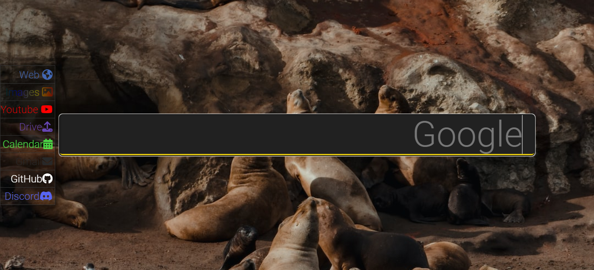

# GoogleNewTemplate

I wanted a different looking homepage but keep the functionality of google.com.

To tackle that, I created [GoogleTemplate](https://github.com/Kuldeep2001/GoogleNewTemplate.git)

It certainly looks better, is responsive and is quite useful.

The website also integrates YouTube search.

Click on the menu on the top right to switch modes:
    
    - Web : Google Search mode
    - Images : Google Images Search mode
    - YouTube : YouTube Search mode
    
Redirects to useful Google sites:

    - Drive
    - Calendar
    - Gmail
    - Github
    - Discord

It looks like this:

